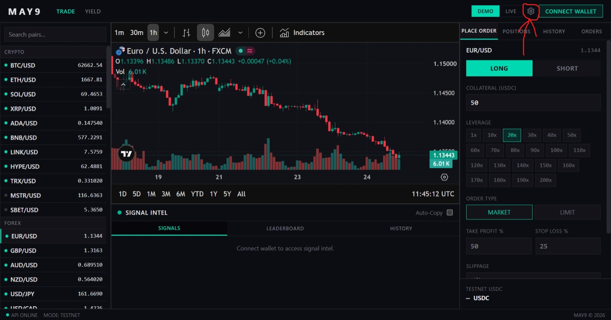
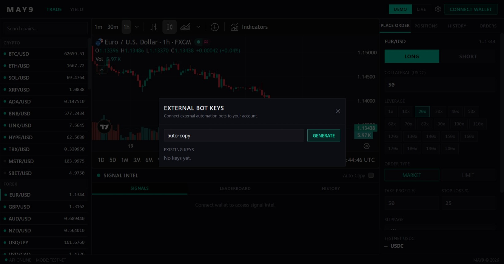

# MAY9

**Professional perpetuals trading, live copy-trading signals, and autonomous on-chain yield — one wallet, one platform.**

MAY9 is a non-custodial DeFi platform built on Base and Arbitrum. Three independent products, one connected experience.

---

## 🧭 Platform Overview

### 01 · Trade — Perpetuals Terminal

A low-latency terminal for trading perpetual futures across 120+ markets — crypto, forex, equities, commodities and indices. Long/short with up to 200x leverage, market and limit orders, TradingView charts, and delegated execution so you never expose your main wallet. Available in Demo and Live mode from the same interface.

### 02 · Signals — Live Copy-Trading Feed

A continuous real-time feed of structured trade ideas across all supported markets. Every signal carries a pair, direction, entry, stop-loss, and targets — issued the moment the opportunity is identified. Track live PnL per signal, view the leaderboard, and copy directly into the terminal in one click. Auto-Copy mode executes signals automatically when enabled.

The **Bot API** (this repository) gives programmatic access to the same signal feed so developers and algorithmic traders can build their own execution layer on top.

### 03 · Yield — Autonomous DEX Liquidity

Deposit USDC and earn passive yield from real swap fees on Uniswap V4 Base. A hook contract monitors every swap, detects price drift and ratio imbalance, and repositions the active range automatically. The StrategyManager continuously evaluates pool candidates and migrates capital when a significantly better opportunity is detected. Each pool has its own isolated vault — your risk never mixes with other depositors.

---

## 🤖 Bot API — Getting Started

The Bot API gives you programmatic access to the MAY9 signal feed. You can use it to receive signals in real time, build custom execution logic, automate your strategy, or integrate MAY9 signals into your own systems.

### Step 1 — Connect your wallet

Visit [app.may9.io](https://may9.netlify.app) and connect your wallet using the **Connect Wallet** button in the top right corner of the terminal.

> Signals are wallet-gated. You must connect a wallet before you can generate a Bot API key.



---

### Step 2 — Generate your Bot API key

Once your wallet is connected, click the **⚙️ Settings icon** in the top navigation bar, next to the DEMO / LIVE toggle.

The **External Bot Keys** modal will open.



1. The key name is pre-filled as `auto-copy`
2. Click **GENERATE**
3. Copy your key immediately — it will not be shown again

You can generate multiple keys for different bots or strategies. Each key is tied to your connected wallet address.

---

### Step 3 — Clone and install

```bash
git clone https://github.com/may9io/May_perp_bot_example.git
cd May_perp_bot_example/may9bot
pip install -r requirements.txt
```

Requirements: Python 3.11+, pip.

---

### Step 4 — Run the bot

```bash
python may9bot.py
```

On first launch, a setup wizard runs automatically and creates `config.json` in the same directory. Enter your Bot API key and preferred settings when prompted.

On every subsequent launch, the main menu appears:

```
MAIN MENU
──────────────────────────────────────────────────────────────────────
  [1]  🚀  Start Bot
  [2]  ⚙  View Config
  [3]  ✏  Edit Config
  [4]  📊  View Open Positions
  [5]  📋  Trade History
  [6]  🚪  Exit
```

---

### Step 5 — Build a Windows executable (optional)

If you want to distribute the bot or run it without a Python install:

```cmd
pip install pyinstaller
pip install -r requirements.txt
pyinstaller may9bot.spec
```

The compiled binary will be at `dist/may9bot.exe`. Place it in any folder — on first launch it runs the setup wizard and creates `config.json` and `trade_log.json` in the same folder.

---

## ⚙️ Configuration Reference

The bot stores all settings in `config.json`. You can edit it via menu option **3** or directly in a text editor.

| Field | Default | Description |
|---|---|---|
| `bot_secret` | `""` | Your MAY9 Bot API key. Required. |
| `mode` | `"mainnet"` | `"mainnet"` or `"testnet"`. Controls which network trades execute on. |
| `collateral_usdc` | `10.0` | USDC collateral per trade. |
| `leverage` | `10` | Leverage per trade. See note below. |
| `sl_percent` | `2.0` | Fallback stop-loss distance from entry (%). Used when the signal does not include an SL. |
| `tp_percent` | `4.0` | Fallback take-profit distance from entry (%). Used when the signal does not include a TP. |
| `breakeven_trigger_pct` | `1.0` | PnL% at which the bot moves the SL to breakeven. |
| `breakeven_offset_pct` | `0.1` | How far above/below entry price the breakeven SL is set (%). |
| `trailing_start_pct` | `2.0` | PnL% at which trailing SL activates. |
| `trailing_distance_pct` | `1.0` | Distance the trailing SL trails behind the current price (%). |
| `trailing_hybrid_switch_pct` | `4.0` | PnL% at which the trailing strategy switches mode. |

> **Note on leverage:** The current release hardcodes leverage to `10x` in the signal executor regardless of the `leverage` config value. This will be made configurable in a future update. The field is reserved — do not remove it from `config.json`.

---

## 📋 Signal Payload

Every signal delivered via WebSocket contains the same structured fields:

| Field | Type | Description |
|-------|------|-------------|
| `id` | string | Unique signal identifier |
| `pair` | string | Trading pair e.g. `EUR/USD`, `BTC/USD` |
| `direction` | `long` / `short` | Trade direction |
| `entry` | number | Suggested entry price at signal issuance |
| `sl` | number | Stop-loss level |
| `tp` | number | Take-profit level |
| `leverage` | number | Suggested leverage |
| `status` | `active` / `closed` / `cancelled` | Current signal state |
| `pnl_pct` | number | Live PnL percentage from entry |
| `issued_at` | ISO 8601 | Timestamp signal was issued |
| `closed_at` | ISO 8601 / null | Timestamp closed, null if still active |
| `issuer` | string | Signal source identifier |

---

## 🏗 Architecture

The bot runs five concurrent async tasks:

```
┌─────────────────────────────────────────────────────┐
│                      may9bot.py                     │
│                    (entry point)                    │
└─────────────────────────┬───────────────────────────┘
                          │
                     ┌────┴────┐
                     │  Bot   │  (orchestrator)
                     └────┬────┘
          ┌───────────────┼───────────────┐
          │               │               │
   ┌──────┴──────┐ ┌──────┴──────┐ ┌─────┴──────┐
   │   Signal    │ │  Bot Event  │ │  Monitor   │
   │  WebSocket  │ │  WebSocket  │ │  (2s tick) │
   └──────┬──────┘ └──────┬──────┘ └─────┬──────┘
          │               │               │
          ▼               ▼               ▼
   SignalExecutor   PositionTracker  Breakeven +
   opens trades     confirmed index  Trailing SL
```

**Task breakdown:**

- **Signal WebSocket** — connects to `/signals/ws`, receives live signals and passes each one to `SignalExecutor`
- **Bot Event WebSocket** — connects to `/trades/ws/bot`, receives confirmed on-chain events (`trade_opened`, `trade_canceled`, `trade_closed`, `auto_close`) and updates `PositionTracker` with the confirmed `trade_index`
- **Monitor** — polls Ostium's price feed every 2 seconds, recalculates PnL for each open position, and triggers breakeven and trailing SL updates automatically
- **Pair map refresh** — re-fetches the full pair list from the backend every 10 minutes
- **Status bar refresh** — updates the terminal status bar every 5 seconds

---

## 🔄 Trade Lifecycle

Understanding this flow is important if you are extending or debugging the bot.

**1. Signal received**

The signal WebSocket delivers a new signal. `SignalExecutor` looks up the `pair_id`, fetches the current price, calculates SL and TP (from the signal or from config fallbacks), and calls `POST /bot/signal` with `action=open`.

**2. Pending position**

The HTTP response returns immediately with a `tx_hash` and an `order_id`. At this point the `trade_index` is not yet confirmed — the position is added to `PositionTracker` with `trade_index=0` as a placeholder. The trade is also written to `trade_log.json` with `trade_index=0`.

**3. On-chain confirmation**

When the transaction is mined, the Bot Event WebSocket receives a `trade_opened` event containing the confirmed `trade_index`, `open_price`, `sl`, and `tp`. The bot updates the in-memory position and the trade log entry with the real `trade_index`.

**4. Active monitoring**

The Monitor loop ticks every 2 seconds. It fetches live prices, updates PnL for every open position, and checks breakeven and trailing SL thresholds. If a threshold is crossed, it calls `POST /bot/signal` with `action=update_sl`.

**5. Close**

When a position closes (market close, SL hit, TP hit, liquidation), the Bot Event WebSocket receives a `trade_closed` or `auto_close` event. The position is removed from `PositionTracker` and the close is recorded in `trade_log.json` with exit price, PnL%, and reason.

---

## 🛡 Risk Management

The bot applies two automatic risk management layers on every open position:

### Breakeven

Once a position's PnL reaches `breakeven_trigger_pct`, the bot moves the SL to entry price plus a small offset (`breakeven_offset_pct`). This locks in a near-zero loss worst case. Breakeven is applied once per position and never reversed.

### Trailing Stop-Loss

Once PnL reaches `trailing_start_pct`, a trailing SL activates. It follows the current price at a fixed distance (`trailing_distance_pct`). For longs, the SL only ever moves up — it never pulls back down. For shorts, it only ever moves down. This lets winners run while protecting accumulated profit.

---

## 🔌 API Endpoints Used

All HTTP calls use the header `X-Bot-Secret: <your_key>`. The WebSocket connections send the same header on the initial upgrade request.

| Method | Path | Auth | Description |
|--------|------|------|-------------|
| `GET` | `/prices/pairs?mode=mainnet` | None | Fetch all supported pairs and their IDs. Called on startup and every 10 minutes. |
| `POST` | `/bot/signal` | `X-Bot-Secret` | Open, close, update SL/TP, or list positions. See action reference below. |
| `WSS` | `/signals/ws` | None | Live signal feed. |
| `WSS` | `/trades/ws/bot` | `X-Bot-Secret` | Confirmed on-chain trade events. |

### `/bot/signal` action reference

**Open a trade**
```json
{
  "action": "open",
  "pair_id": 3,
  "collateral": 10.0,
  "leverage": 10,
  "direction": true,
  "order_type": "MARKET"
}
```

**Close a trade**
```json
{
  "action": "close",
  "pair_id": 3,
  "trade_index": 1,
  "close_percentage": 100
}
```

**Update stop-loss**
```json
{
  "action": "update_sl",
  "pair_id": 3,
  "trade_index": 1,
  "sl_price": 61200.0
}
```

**Update take-profit**
```json
{
  "action": "update_tp",
  "pair_id": 3,
  "trade_index": 1,
  "tp_price": 65000.0
}
```

**List open positions**
```json
{
  "action": "positions",
  "pair_id": 0
}
```

---

## 📂 Repository Structure

```
may9bot/
├── may9bot.py              Entry point — menu loop and async runner
├── may9bot.spec            PyInstaller spec for Windows .exe build
├── requirements.txt        Python dependencies (aiohttp, websockets)
├── core/
│   ├── bot.py              Orchestrator — starts all async tasks
│   ├── backend_client.py   HTTP client — all calls to /bot/signal
│   ├── config_manager.py   Reads/writes config.json, holds backend URLs
│   ├── signal_executor.py  Receives a signal, computes SL/TP, opens trade
│   ├── monitor.py          Price polling loop, breakeven and trailing SL logic
│   ├── position_tracker.py In-memory position store with live PnL calculation
│   ├── price_feed.py       Fetches live prices from Ostium metadata endpoint
│   └── trade_log.py        Persists trade history to trade_log.json
└── ui/
    └── terminal.py         All terminal rendering and the setup wizard
```

### Files created at runtime

| File | Location | Purpose |
|------|----------|---------|
| `config.json` | Same folder as the bot | All settings. Edit via menu or directly. |
| `trade_log.json` | Same folder as the bot | Full trade history with entry, exit, PnL, and reason. |

---

## 🔁 Position Recovery on Restart

When the bot starts, it calls `POST /bot/signal` with `action=positions` to fetch all currently open trades from the backend. These are loaded into `PositionTracker` so the Monitor loop resumes tracking and risk management without missing a beat. Any positions opened in a previous session are fully recovered including entry price, SL, TP, leverage, and direction.

---

## 🛠 Troubleshooting

**`HTTP 403` on bot event WebSocket**

Your `bot_secret` is missing, invalid, or has been revoked. Regenerate a key from the settings modal and update `config.json`.

**`HTTP 500` on bot event WebSocket**

The server rejected the connection before your handler ran. This usually means the secret header was not sent correctly. Make sure you are running the latest version of the bot — earlier versions passed the secret as a URL query parameter which is no longer supported.

**Signal received but no trade opened**

The pair in the signal is not in the supported pair list. The bot logs a warning: `Signal pair 'X/Y' not supported — skipping`. Check the pair name matches exactly what `/prices/pairs` returns.

**`trade_index` stays 0 after a trade opens**

The Bot Event WebSocket is not connected or is not receiving `trade_opened` events. Check the bot event stream connection status in the terminal output. Without a confirmed `trade_index`, SL and TP updates will target the wrong trade.

**Leverage is always 10x regardless of config**

This is a known limitation in the current release. Leverage is hardcoded in `core/signal_executor.py`. The `leverage` config field is reserved for a future update.

**Bot exits immediately after `Start Bot`**

The backend URLs in `core/config_manager.py` are hardcoded and not user-configurable. If the backend is unreachable (e.g. the Render instance is cold-starting), the pair map fetch will fail and the bot will return to the menu. Wait 30 seconds and try again.

---

## ✅ What is guaranteed

- **Signal structure** — every signal will always contain the fields documented above. The schema will not change without a versioned update and advance notice.
- **Real-time delivery** — signals are pushed as issued, without delay on the platform side.
- **Key persistence** — your API key remains valid until you revoke it from the settings modal.
- **Non-custodial** — MAY9 never holds your funds. Every position is wallet-native.

---

## ❌ What is NOT guaranteed

- **Signal performance** — past win rates and PnL figures are historical records, not a guarantee of future results. Signals can and do result in losses. Never risk capital you cannot afford to lose.
- **Entry availability** — signals are issued in real time. By the time your bot receives and executes a signal, the entry price may have moved. Execution slippage is your responsibility.
- **Uptime** — MAY9 is an early-stage protocol. Downtime, maintenance windows, and API changes may occur. Watch this repository and our X account for updates.

---

## ⚠️ Risk Disclosure

Trading perpetual futures involves significant risk of loss. Leverage amplifies both gains and losses. Use Demo mode before trading with real funds.

Nothing on this platform or in this repository constitutes financial advice.

---

## 🔗 Links

| | |
|--|--|
| Platform | [app.may9.io](https://may9.netlify.app) |
| Terminal | [app.may9.io/terminal](https://may9.netlify.app/terminal) |
| Yield | [app.may9.io/yield](https://may9.netlify.app/yield) |
| X / Twitter | [@may9io]() |

---

*MAY9 © 2026 · Non-custodial · Built on Base and Arbitrum*